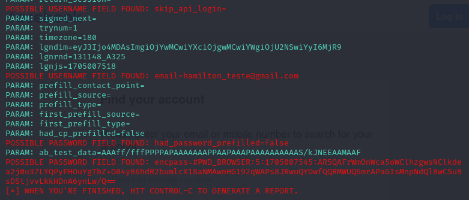

# Phishing para captura de senhas do Facebook (Desafio DIO)

### 🛠 Ferramentas

  - VirtualBox
  - Kali Linux
  - setoolkit

### Configurando o Phishing no Kali Linux

  * Abra o Kali pelo VirtualBox;
  * Inicie o terminal de comandos;
  * Execute os passos a seguir pressionando _Enter_ após cada comando.

  **Comandos em ordem para criar o Phishing:**
  - Obtendo o endereço da máquina: ``` ifconfig ```
  - Acesso root: ``` sudo su ```
  - Digitar sua senha de superusuário.
  - Iniciando o setoolkit: ``` setoolkit ```
  - Tipo de ataque: ``` 1- Social-Engineering Attacks ```
  - Vetor de ataque: ``` 2- Web Site Attack Vectors ```
  - Método de ataque: ``` 3- Credential Harvester Attack Method ```
  - Método de ataque: ``` 2- Site Cloner ```
  - Por padrão a ferramenta já indica o IP, mas este pode ser trocado. Por isto que fez-se o comando _ifconfig_ no início.
  - URL para clone: http://www.facebook.com

  * Acesse o navegador e digite o IP fornecido para o phishing;
  * Entre com um login e senha, por sua conta e risco.

### Resutado


